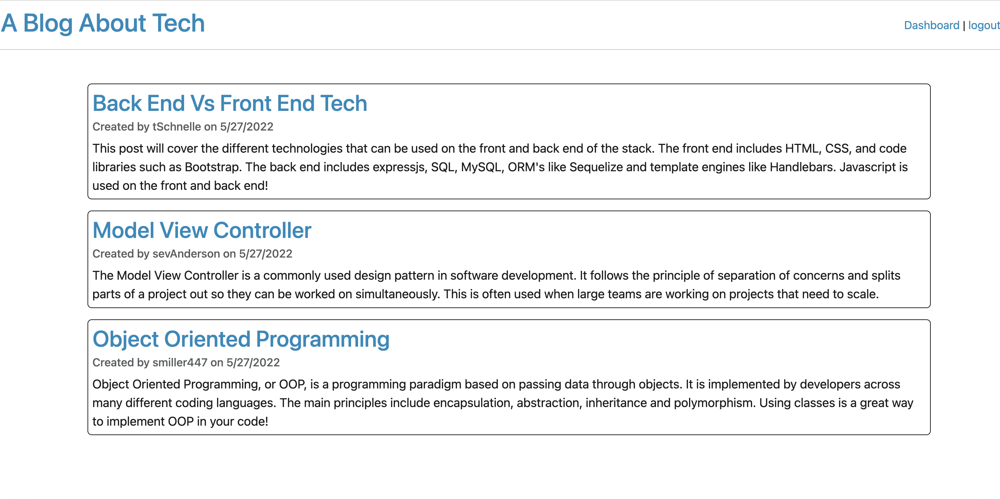

# MVC Tech Blog

## Table of Contents

- [Description](#description)
- [Installation](#installation)
- [Usage](#usage)
- [Contributing](#contributing)
- [Tests](#tests)
- [License](#license)
- [Questions](#questions)

## Description

This is a full stack application utilizing nodejs, express, sequelize, MySQL2, handlebars, bcrypt and bootstrap to present the user with a tech blog. The user is able to create an account, or log into an existing account and then they can read and comment on blog posts, or write their own posts.

## Installation

To access the site, click the link [here](https://tech-blog-mvc-sgm.herokuapp.com/). To install the code files, clone the github repo.

## Usage

The use case is for someone interested in tech to share their ideas in a community of other tech enthusiasts. They can do so in a secure site where they have an account set up.

## Contributing

To contribute, clone the repo, make a new branch and manipulate the code. Then request to merge those changes back into the main branch.

## Tests

There are no tests.

## License

    MIT

## Questions

- [GitHub profile](https://github.com/millersg47)
- Contact Me at millersg47@gmail.com with additional questions
